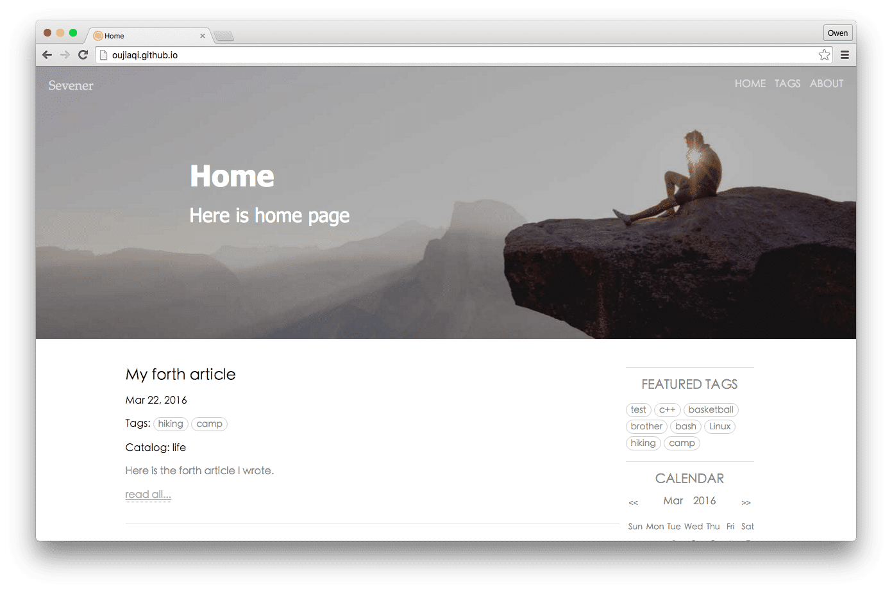
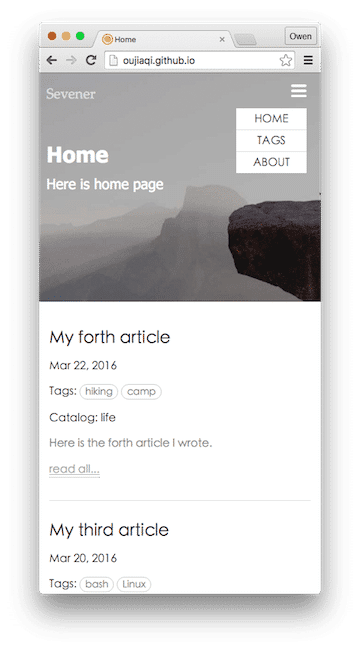

# My Blog
A blog template based on jekyll.

### [View My Blog](http://oujiaqi.github.io)





## Features

* Develop based on jekyll, with raw JavaScript and CSS3.
* Design by responsive idea, fit in different size of screen.

## How to use

Download this template and replace your site with this template. And then modify the setting file "_config.yml". Start your jekyll serve and the template will work.

## About configuration

### Getting start

"_config.yml" is the static configuration file, only work when you start your jekyll serve.

You could modify the default configuration of your site in this file.

```bash
# Default configuration
static_css: /assets/css/main.css
article_css: /assets/css/article.css
highlight_css: /assets/css/highlight.css
static_js: /assets/js/main.js
site_icon: /assets/imgs/site-icon.png
header_img: /assets/imgs/header-img.jpg
```

And so on things. Attention that the path of the resource must be integrated.

### Add recommended links

Here you can add a list of links that you want to recommend to people.
Just like this.

```bash
# Recommended links
links: [{
        title: "智图压缩",
        href: "http://zhitu.isux.us/"
    },{
        title: "动画工具",
        href: "http://isux.tencent.com/css3/tools.html"
    },{
        title: "廖雪峰",
        href: "http://www.liaoxuefeng.com/"
    },{
        title: "火影",
        href: "http://www.dilidili.com/anime/naruto/story/"
    },{
        title: "Naruto",
        href: "http://naruto-ten.com/"
    }]
```

### Write posts

There is a folder named "_post". Articles you want to publish should place in it. And each article also has its own "yml" configuration. You could change it. And your article formula could be HTML or markdown.

```bash
---
layout: post
title: My first article
subtitle: My first article subtitle
date: '2016-03-18 13:29:01 +0800'
catalog: study
excerpt: Here is the first article I wrote.
tags: [test, c++]
categories: articles study c++
header_img: /assets/imgs/akatsuki.jpg
---
```

### Other pages

There are many pages that not in the "_post" folder. These pages could place anywhere of the folder. But you should configure it at the top of cotent. Here is an example.

```bash
---
layout: home
title: Home
subtitle: Here is home page
permalink: /
nav_bool: true
nav_order: 1
extra_css: /assets/css/calendar.css
---
```

The "nav_bool" value is designed to find out wether this page will place on the nav area or not.
And the "nav_order" value is designed to determine the order. The smaller number will place to the left more. The "permalink" value can assigned the permanent link of the page.


